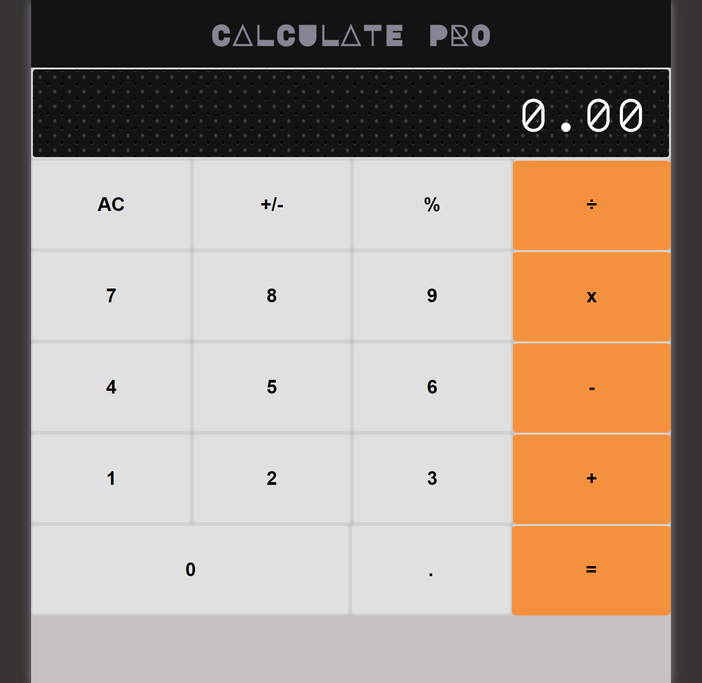

## Calculator
  This a custom implementation of a calculator web app.

## Preview
|                |                |
|----------------|----------------|
|||

## Live version
[calculator](https://calculatepro.herokuapp.com/)

## Technologies
  - React
  - Javascript
  - HTML
  - CSS

## Installation
Follow the steps below to test the project locally. First ensure you have a version of [Node.js](http://nodejs.org/) equal or greater than v6.10.0 installed.

1. Clone the repository from a terminal `https://github.com/codecell/calculator.git`.
2. Navigate to the project directory `cd calculator`.
3. Install project dependencies `npm install` OR `yarn install`.
4. Run `npm startl` OR `yarn start` to compile  and serve a development build live on `http://localhost:3000` 
or any other port randomly available to React.

👤 **Ezaka Alfred**

- Github: [@Codecell](https://github.com/codecell)
- Twitter: [@Codecell](https://twitter.com/the_codecell)
- LinkedIn: [@Codecell](https://www.linkedin.com/in/alfrednoble/)

## Show your support

Give a ⭐️ if you like this project!